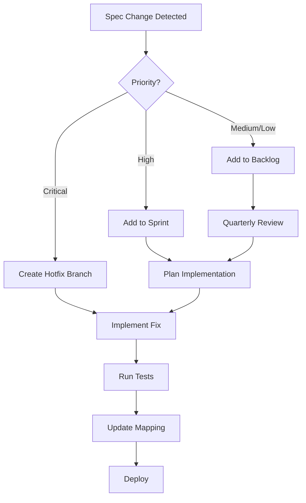
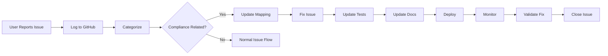

# План отслеживания соответствия кода официальной спецификации OpenAI Responses API

## Дата создания: 2025-11-24
## Версия спецификации: OpenAI Platform API Reference (актуальная)

---

## 1. Executive Summary

Этот документ описывает систему постоянного мониторинга соответствия кода vLLM официальной спецификации OpenAI Responses API.

**Цели:**
- Обеспечить 100% совместимость с официальной спецификацией
- Автоматически отслеживать изменения в документации OpenAI
- Быстро реагировать на расхождения
- Предотвращать регрессии совместимости

**Источники reference:**
- `DOC_responses.md` - официальная спецификация Responses API
- `DOC_streaming_events.md` - спецификация streaming событий
- `https://platform.openai.com/docs/api-reference/responses`

---

## 2. Структура отслеживания

### 2.1. Mapping спецификации на код

Создаём файл `SPEC_TO_CODE_MAPPING.json` с полной картой соответствия:

```json
{
  "version": "2025-11-24",
  "spec_source": "DOC_responses.md + DOC_streaming_events.md",
  "mappings": {
    "endpoints": {
      "POST /v1/responses": {
        "spec_line": "DOC_responses.md:194-673",
        "code_file": "vllm/entrypoints/openai/api_server.py",
        "code_line": "896-989",
        "handler": "create_responses",
        "request_model": "ResponsesRequest",
        "response_model": "ResponsesResponse",
        "status": "implemented",
        "compliance_score": 95,
        "known_issues": [
          "delta format issue (fixed 2025-11-24)",
          "missing tool_outputs endpoint integration"
        ]
      },
      "GET /v1/responses/{id}": {
        "spec_line": "DOC_responses.md:677-825",
        "code_file": "vllm/entrypoints/openai/api_server.py",
        "code_line": "1079-1141",
        "handler": "retrieve_responses",
        "status": "implemented",
        "compliance_score": 100
      },
      "DELETE /v1/responses/{id}": {
        "spec_line": "DOC_responses.md:829-881",
        "code_file": null,
        "status": "not_implemented",
        "compliance_score": 0,
        "priority": "low"
      },
      "POST /v1/responses/{id}/cancel": {
        "spec_line": "DOC_responses.md:884-990",
        "code_file": "vllm/entrypoints/openai/api_server.py",
        "code_line": "1143-1179",
        "status": "implemented",
        "compliance_score": 100
      },
      "POST /v1/responses/{id}/tool_outputs": {
        "spec_line": "DOC_responses.md:1181-1221",
        "code_file": "vllm/entrypoints/openai/api_server.py",
        "code_line": "1181-1221",
        "status": "partially_implemented",
        "compliance_score": 60,
        "known_issues": [
          "Different workflow: uses previous_response_id instead"
        ]
      },
      "GET /v1/responses/{id}/input_items": {
        "spec_line": "DOC_responses.md:993-1101",
        "code_file": "vllm/entrypoints/openai/api_server.py",
        "code_line": "1188-1237",
        "status": "implemented",
        "compliance_score": 100,
        "handler": "list_response_input_items",
        "store_dependency": "Requires store=true"
      },
      "POST /v1/responses/input_tokens": {
        "spec_line": "DOC_responses.md:1104-1339",
        "code_file": null,
        "status": "not_implemented",
        "compliance_score": 0,
        "priority": "low"
      },
      "POST /v1/conversations": {
        "spec_line": "DOC_conversations.md:20-120",
        "code_file": null,
        "status": "not_implemented",
        "compliance_score": 0,
        "priority": "medium",
        "description": "Create a persistent conversation container."
      },
      "GET /v1/conversations/{conversation_id}": {
        "spec_line": "DOC_conversations.md:120-190",
        "code_file": null,
        "status": "not_implemented",
        "compliance_score": 0,
        "priority": "medium"
      },
      "POST /v1/conversations/{conversation_id}": {
        "spec_line": "DOC_conversations.md:190-240",
        "code_file": null,
        "status": "not_implemented",
        "compliance_score": 0,
        "priority": "medium",
        "description": "Update conversation metadata (title, tags, etc.)."
      },
      "DELETE /v1/conversations/{conversation_id}": {
        "spec_line": "DOC_conversations.md:240-280",
        "code_file": null,
        "status": "not_implemented",
        "compliance_score": 0,
        "priority": "medium"
      },
      "GET /v1/conversations/{conversation_id}/items": {
        "spec_line": "DOC_conversations.md:280-360",
        "code_file": null,
        "status": "not_implemented",
        "compliance_score": 0,
        "priority": "medium"
      },
      "POST /v1/conversations/{conversation_id}/items": {
        "spec_line": "DOC_conversations.md:360-440",
        "code_file": null,
        "status": "not_implemented",
        "compliance_score": 0,
        "priority": "medium",
        "description": "Append new assistant/user/tool messages to a conversation."
      },
      "GET /v1/conversations/{conversation_id}/items/{item_id}": {
        "spec_line": "DOC_conversations.md:440-500",
        "code_file": null,
        "status": "not_implemented",
        "compliance_score": 0,
        "priority": "medium"
      },
      "DELETE /v1/conversations/{conversation_id}/items/{item_id}": {
        "spec_line": "DOC_conversations.md:500-560",
        "code_file": null,
        "status": "not_implemented",
        "compliance_score": 0,
        "priority": "low"
      }
    },
    "request_parameters": {
      "ResponsesRequest": {
        "background": {
          "spec": "DOC_responses.md:208-217",
          "code": "protocol.py:341 (field in ResponsesRequest)",
          "status": "implemented",
          "type_match": true
        },
        "conversation": {
          "spec": "DOC_responses.md:219-231",
          "code": "protocol.py:357",
          "status": "implemented",
          "type_match": true
        },
        "include": {
          "spec": "DOC_responses.md:232-246",
          "code": "protocol.py:367",
          "status": "implemented",
          "type_match": true,
          "supported_values": [
            "reasoning.encrypted_content",
            "message.output_text.logprobs"
          ],
          "missing_values": [
            "web_search_call.action.sources",
            "code_interpreter_call.outputs",
            "computer_call_output.output.image_url",
            "file_search_call.results",
            "message.input_image.image_url"
          ]
        },
        "input": {
          "spec": "DOC_responses.md:248-264",
          "code": "protocol.py:374",
          "status": "implemented",
          "type_match": true
        },
        "instructions": {
          "spec": "DOC_responses.md:266-277",
          "code": "protocol.py:383",
          "status": "implemented",
          "type_match": true
        },
        "max_output_tokens": {
          "spec": "DOC_responses.md:278-284",
          "code": "protocol.py:386",
          "status": "implemented",
          "type_match": true
        },
        "max_tool_calls": {
          "spec": "DOC_responses.md:286-292",
          "code": "protocol.py:388",
          "status": "implemented",
          "type_match": true
        },
        "metadata": {
          "spec": "DOC_responses.md:294-305",
          "code": "protocol.py:391",
          "status": "implemented",
          "type_match": true
        },
        "model": {
          "spec": "DOC_responses.md:307-316",
          "code": "protocol.py:398",
          "status": "implemented",
          "type_match": true
        },
        "parallel_tool_calls": {
          "spec": "DOC_responses.md:318-326",
          "code": "protocol.py:401",
          "status": "implemented",
          "type_match": true
        },
        "previous_response_id": {
          "spec": "DOC_responses.md:328-336",
          "code": "protocol.py:404",
          "status": "implemented",
          "type_match": true,
          "note": "vLLM uses this instead of tool_outputs endpoint"
        },
        "prompt": {
          "spec": "DOC_responses.md:338-346",
          "code": "protocol.py:407",
          "status": "not_implemented",
          "type_match": false
        },
        "prompt_cache_key": {
          "spec": "DOC_responses.md:349-355",
          "code": "protocol.py:413",
          "status": "implemented",
          "type_match": true,
          "note": "Maps to cache_salt in vLLM"
        },
        "prompt_cache_retention": {
          "spec": "DOC_responses.md:357-363",
          "code": null,
          "status": "not_implemented"
        },
        "reasoning": {
          "spec": "DOC_responses.md:365-376",
          "code": "protocol.py:418",
          "status": "implemented",
          "type_match": true
        },
        "safety_identifier": {
          "spec": "DOC_responses.md:378-385",
          "code": null,
          "status": "not_implemented"
        },
        "service_tier": {
          "spec": "DOC_responses.md:387-402",
          "code": "protocol.py:428",
          "status": "implemented",
          "type_match": true
        },
        "store": {
          "spec": "DOC_responses.md:404-413",
          "code": "protocol.py:441",
          "status": "implemented",
          "type_match": true
        },
        "stream": {
          "spec": "DOC_responses.md:415-426",
          "code": "protocol.py:443",
          "status": "implemented",
          "type_match": true
        },
        "stream_options": {
          "spec": "DOC_responses.md:428-438",
          "code": "protocol.py:447",
          "status": "implemented",
          "type_match": true
        },
        "temperature": {
          "spec": "DOC_responses.md:440-449",
          "code": "protocol.py:451",
          "status": "implemented",
          "type_match": true
        },
        "text": {
          "spec": "DOC_responses.md:451-463",
          "code": "protocol.py:455",
          "status": "implemented",
          "type_match": true
        },
        "tool_choice": {
          "spec": "DOC_responses.md:465-475",
          "code": "protocol.py:463",
          "status": "implemented",
          "type_match": true
        },
        "tools": {
          "spec": "DOC_responses.md:477-501",
          "code": "protocol.py:471",
          "status": "implemented",
          "type_match": true,
          "note": "Only function calling, no built-in tools"
        },
        "top_logprobs": {
          "spec": "DOC_responses.md:503-509",
          "code": "protocol.py:481",
          "status": "implemented",
          "type_match": true
        },
        "top_p": {
          "spec": "DOC_responses.md:511-525",
          "code": "protocol.py:483",
          "status": "implemented",
          "type_match": true
        },
        "truncation": {
          "spec": "DOC_responses.md:527-541",
          "code": "protocol.py:486",
          "status": "implemented",
          "type_match": true
        },
        "user": {
          "spec": "DOC_responses.md:543-553",
          "code": "protocol.py:491",
          "status": "implemented",
          "type_match": true,
          "deprecated": true
        }
      }
    },
    "streaming_events": {
      "response.created": {
        "spec": "DOC_streaming_events.md:304-367",
        "code": "serving_responses.py:_build_response_created_event",
        "status": "implemented",
        "compliance_score": 100
      },
      "response.in_progress": {
        "spec": "DOC_streaming_events.md:369-432",
        "code": null,
        "status": "not_implemented",
        "compliance_score": 0,
        "priority": "low"
      },
      "response.completed": {
        "spec": "DOC_streaming_events.md:434-514",
        "code": "serving_responses.py:_build_response_completed_event",
        "status": "implemented",
        "compliance_score": 100
      },
      "response.failed": {
        "spec": "DOC_streaming_events.md:516-577",
        "code": "serving_responses.py:_build_response_failed_event",
        "status": "implemented",
        "compliance_score": 100
      },
      "response.incomplete": {
        "spec": "DOC_streaming_events.md:579-640",
        "code": "serving_responses.py:responses_stream_generator",
        "status": "implemented",
        "compliance_score": 100
      },
      "response.output_item.added": {
        "spec": "DOC_streaming_events.md:642-687",
        "code": "serving_responses.py:_build_output_item_added_event",
        "status": "implemented",
        "compliance_score": 100
      },
      "response.output_item.done": {
        "spec": "DOC_streaming_events.md:689-740",
        "code": "serving_responses.py:_build_output_item_done_event",
        "status": "implemented",
        "compliance_score": 100
      },
      "response.content_part.added": {
        "spec": "DOC_streaming_events.md:742-799",
        "code": "serving_responses.py:_build_content_part_added_event",
        "status": "implemented",
        "compliance_score": 100
      },
      "response.content_part.done": {
        "spec": "DOC_streaming_events.md:801-858",
        "code": "serving_responses.py:_build_content_part_done_event",
        "status": "implemented",
        "compliance_score": 100
      },
      "response.output_text.delta": {
        "spec": "DOC_streaming_events.md:860-919",
        "code": "serving_responses.py:_process_harmony_streaming_events",
        "status": "implemented",
        "compliance_score": 100
      },
      "response.output_text.done": {
        "spec": "DOC_streaming_events.md:921-980",
        "code": "serving_responses.py:_process_harmony_streaming_events",
        "status": "implemented",
        "compliance_score": 100
      },
      "response.refusal.delta": {
        "spec": "DOC_streaming_events.md:982-1033",
        "code": null,
        "status": "not_implemented",
        "compliance_score": 0,
        "priority": "medium"
      },
      "response.refusal.done": {
        "spec": "DOC_streaming_events.md:1035-1086",
        "code": null,
        "status": "not_implemented",
        "compliance_score": 0,
        "priority": "medium"
      },
      "response.function_call_arguments.delta": {
        "spec": "DOC_streaming_events.md:1088-1132",
        "code": "serving_responses.py:_build_tool_call_delta_event",
        "status": "implemented",
        "compliance_score": 100
      },
      "response.function_call_arguments.done": {
        "spec": "DOC_streaming_events.md:1134-1183",
        "code": "serving_responses.py:_build_tool_call_done_event",
        "status": "implemented",
        "compliance_score": 100
      },
      "response.file_search_call.in_progress": {
        "spec": "DOC_streaming_events.md:1185-1224",
        "code": "serving_responses.py:_build_file_search_call_events",
        "status": "implemented",
        "compliance_score": 100
      },
      "response.file_search_call.searching": {
        "spec": "DOC_streaming_events.md:1225-1264",
        "code": "serving_responses.py:_build_file_search_call_events",
        "status": "implemented",
        "compliance_score": 100
      },
      "response.file_search_call.completed": {
        "spec": "DOC_streaming_events.md:1265-1304",
        "code": "serving_responses.py:_build_file_search_call_events",
        "status": "implemented",
        "compliance_score": 100
      },
      "response.web_search_call.in_progress": {
        "spec": "DOC_streaming_events.md:1305-1344",
        "code": null,
        "status": "not_implemented",
        "priority": "medium",
        "compliance_score": 0
      },
      "response.web_search_call.searching": {
        "spec": "DOC_streaming_events.md:1345-1384",
        "code": null,
        "status": "not_implemented",
        "priority": "medium",
        "compliance_score": 0
      },
      "response.web_search_call.completed": {
        "spec": "DOC_streaming_events.md:1385-1424",
        "code": null,
        "status": "not_implemented",
        "priority": "medium",
        "compliance_score": 0
      },
      "response.image_generation_call.completed": {
        "spec": "DOC_streaming_events.md:1753-1792",
        "code": "serving_responses.py:_build_image_generation_call_events",
        "status": "implemented",
        "compliance_score": 100
      },
      "response.image_generation_call.generating": {
        "spec": "DOC_streaming_events.md:1793-1832",
        "code": "serving_responses.py:_build_image_generation_call_events",
        "status": "implemented",
        "compliance_score": 100
      },
      "response.image_generation_call.in_progress": {
        "spec": "DOC_streaming_events.md:1833-1872",
        "code": "serving_responses.py:_build_image_generation_call_events",
        "status": "implemented",
        "compliance_score": 100
      },
      "response.image_generation_call.partial_image": {
        "spec": "DOC_streaming_events.md:1873-1925",
        "code": "serving_responses.py:_build_image_generation_call_events",
        "status": "implemented",
        "compliance_score": 100
      },
      "response.code_interpreter_call.in_progress": {
        "spec": "DOC_streaming_events.md:2254-2292",
        "code": null,
        "status": "not_implemented",
        "priority": "medium",
        "compliance_score": 0
      },
      "response.code_interpreter_call.interpreting": {
        "spec": "DOC_streaming_events.md:2293-2331",
        "code": null,
        "status": "not_implemented",
        "priority": "medium",
        "compliance_score": 0
      },
      "response.code_interpreter_call.completed": {
        "spec": "DOC_streaming_events.md:2332-2370",
        "code": null,
        "status": "not_implemented",
        "priority": "medium",
        "compliance_score": 0
      },
      "response.code_interpreter_call_code.delta": {
        "spec": "DOC_streaming_events.md:2371-2416",
        "code": null,
        "status": "not_implemented",
        "priority": "medium",
        "compliance_score": 0
      },
      "response.code_interpreter_call_code.done": {
        "spec": "DOC_streaming_events.md:2417-2462",
        "code": null,
        "status": "not_implemented",
        "priority": "medium",
        "compliance_score": 0
      },
      "response.reasoning_text.delta": {
        "spec": "DOC_streaming_events.md:1647-1698",
        "code": "serving_responses.py:_build_reasoning_delta_event",
        "status": "implemented",
        "compliance_score": 100,
        "fixed": "2025-11-24 (Bug #4 - delta format)"
      },
      "response.reasoning_text.done": {
        "spec": "DOC_streaming_events.md:1700-1751",
        "code": "serving_responses.py:_build_reasoning_done_event",
        "status": "implemented",
        "compliance_score": 100
      },
      "response.reasoning_summary_text.delta": {
        "spec": "DOC_streaming_events.md:1541-1592",
        "code": "serving_responses.py:_generate_reasoning_summary_events",
        "status": "implemented",
        "compliance_score": 100
      },
      "response.reasoning_summary_text.done": {
        "spec": "DOC_streaming_events.md:1594-1645",
        "code": "serving_responses.py:_generate_reasoning_summary_events",
        "status": "implemented",
        "compliance_score": 100
      },
      "response.queued": {
        "spec": "DOC_streaming_events.md:2528-2565",
        "code": "serving_responses.py:3396-3458",
        "status": "implemented",
        "compliance_score": 100,
        "priority": "low"
      },
      "error": {
        "spec": "DOC_streaming_events.md:2657-2701",
        "code": "api_server.py:error handling",
        "status": "implemented",
        "compliance_score": 90,
        "note": "Format slightly different"
      }
    }
  }
}

### Conversations API Coverage

Per `DOC_conversations.md`, the official API exposes dedicated endpoints for
storing conversation state (`/v1/conversations`, item CRUD, etc.). These were
not part of the original roadmap. Section 13.2 now tracks their implementation
status, and each endpoint is explicitly listed above so SPEC_TO_CODE mapping can
be extended once code support lands.

### Built-in Tool Streaming Events

OpenAI emits additional streaming events for built-in tools (Web Search, File
Search, Code Interpreter, Image Generation). These events are now enumerated in
the mapping table with explicit spec references (DOC_streaming_events.md) so
that future work can add parity. Until the tool backends exist, the events
remain `not_implemented` in the mapping.
```

---

## 3. Контрольные точки проверки

### 3.1. Ежедневные автоматические проверки

**Скрипт:** `scripts/check_openai_compliance.py`

```python
#!/usr/bin/env python3
"""
Automated compliance checker for OpenAI Responses API.
Runs daily via CI/CD.
"""

import json
from pathlib import Path
from typing import Dict, List

class ComplianceChecker:
    def __init__(self, mapping_file: str = "SPEC_TO_CODE_MAPPING.json"):
        self.mapping = json.loads(Path(mapping_file).read_text())
        self.issues = []

    def check_endpoints(self) -> Dict[str, any]:
        """Check all endpoints implementation status."""
        results = {
            "total": 0,
            "implemented": 0,
            "missing": 0,
            "partial": 0,
            "issues": []
        }

        for endpoint, info in self.mapping["mappings"]["endpoints"].items():
            results["total"] += 1
            status = info["status"]

            if status == "implemented":
                results["implemented"] += 1
                # Verify file exists
                if info["code_file"]:
                    file_path = Path(info["code_file"])
                    if not file_path.exists():
                        results["issues"].append(
                            f"MISSING FILE: {endpoint} -> {info['code_file']}"
                        )
            elif status == "not_implemented":
                results["missing"] += 1
                if info.get("priority") == "high":
                    results["issues"].append(
                        f"HIGH PRIORITY MISSING: {endpoint}"
                    )
            elif status == "partially_implemented":
                results["partial"] += 1
                results["issues"].append(
                    f"PARTIAL: {endpoint} - {info.get('known_issues', [])}"
                )

        return results

    def check_request_parameters(self) -> Dict[str, any]:
        """Check request parameter coverage."""
        results = {
            "total": 0,
            "implemented": 0,
            "missing": 0,
            "type_mismatches": []
        }

        params = self.mapping["mappings"]["request_parameters"]["ResponsesRequest"]
        for param_name, param_info in params.items():
            results["total"] += 1

            if param_info["status"] == "implemented":
                results["implemented"] += 1
                if not param_info.get("type_match", True):
                    results["type_mismatches"].append(param_name)
            else:
                results["missing"] += 1

        return results

    def check_streaming_events(self) -> Dict[str, any]:
        """Check streaming events implementation."""
        results = {
            "total": 0,
            "implemented": 0,
            "missing": 0,
            "high_priority_missing": [],
            "average_compliance": 0
        }

        events = self.mapping["mappings"]["streaming_events"]
        total_score = 0

        for event_name, event_info in events.items():
            results["total"] += 1
            total_score += event_info["compliance_score"]

            if event_info["status"] == "implemented":
                results["implemented"] += 1
            else:
                results["missing"] += 1
                if event_info.get("priority") == "high":
                    results["high_priority_missing"].append(event_name)

        results["average_compliance"] = total_score / results["total"]
        return results

    def generate_report(self) -> str:
        """Generate compliance report."""
        report = ["# OpenAI Responses API Compliance Report"]
        report.append(f"Date: {datetime.now().isoformat()}\n")

        # Endpoints
        ep_results = self.check_endpoints()
        report.append("## Endpoints")
        report.append(f"- Total: {ep_results['total']}")
        report.append(f"- Implemented: {ep_results['implemented']}")
        report.append(f"- Missing: {ep_results['missing']}")
        report.append(f"- Partial: {ep_results['partial']}")
        if ep_results["issues"]:
            report.append("\n### Issues:")
            for issue in ep_results["issues"]:
                report.append(f"- {issue}")

        # Parameters
        param_results = self.check_request_parameters()
        report.append("\n## Request Parameters")
        report.append(f"- Total: {param_results['total']}")
        report.append(f"- Implemented: {param_results['implemented']}")
        report.append(f"- Missing: {param_results['missing']}")
        if param_results["type_mismatches"]:
            report.append(f"- Type mismatches: {', '.join(param_results['type_mismatches'])}")

        # Events
        event_results = self.check_streaming_events()
        report.append("\n## Streaming Events")
        report.append(f"- Total: {event_results['total']}")
        report.append(f"- Implemented: {event_results['implemented']}")
        report.append(f"- Missing: {event_results['missing']}")
        report.append(f"- Average compliance: {event_results['average_compliance']:.1f}%")
        if event_results["high_priority_missing"]:
            report.append("\n### High Priority Missing:")
            for event in event_results["high_priority_missing"]:
                report.append(f"- {event}")

        return "\n".join(report)

    def run(self):
        """Run all checks and save report."""
        report = self.generate_report()
        output_path = Path(f"compliance_reports/report_{datetime.now().date()}.md")
        output_path.parent.mkdir(exist_ok=True)
        output_path.write_text(report)
        print(report)

        # Exit with error if critical issues found
        event_results = self.check_streaming_events()
        if event_results["high_priority_missing"]:
            sys.exit(1)

if __name__ == "__main__":
    checker = ComplianceChecker()
    checker.run()
```

### 3.2. CI/CD интеграция

**`.github/workflows/openai_compliance.yml`:**

```yaml
name: OpenAI API Compliance Check

on:
  push:
    branches: [main]
  pull_request:
    branches: [main]
  schedule:
    # Run daily at 00:00 UTC
    - cron: '0 0 * * *'

jobs:
  compliance:
    runs-on: ubuntu-latest
    steps:
      - uses: actions/checkout@v4

      - name: Set up Python
        uses: actions/setup-python@v5
        with:
          python-version: '3.12'

      - name: Run compliance checker
        run: |
          python scripts/check_openai_compliance.py

      - name: Upload compliance report
        uses: actions/upload-artifact@v4
        with:
          name: compliance-report
          path: compliance_reports/

```

---

## 4. Отслеживание изменений в спецификации

### 4.1. Мониторинг официальной документации

**Скрипт:** `scripts/monitor_spec_changes.py`

```python
#!/usr/bin/env python3
"""
Monitor changes in OpenAI API specification.
"""

import hashlib
import json
from pathlib import Path
from datetime import datetime

class SpecMonitor:
    def __init__(self):
        self.spec_files = [
            "DOC_responses.md",
            "DOC_streaming_events.md"
        ]
        self.history_file = ".spec_history.json"
        self.load_history()

    def load_history(self):
        """Load hash history of spec files."""
        if Path(self.history_file).exists():
            self.history = json.loads(Path(self.history_file).read_text())
        else:
            self.history = {"files": {}}

    def save_history(self):
        """Save hash history."""
        Path(self.history_file).write_text(
            json.dumps(self.history, indent=2)
        )

    def compute_hash(self, file_path: str) -> str:
        """Compute SHA256 hash of file."""
        return hashlib.sha256(
            Path(file_path).read_bytes()
        ).hexdigest()

    def check_for_changes(self) -> List[Dict]:
        """Check if spec files have changed."""
        changes = []

        for spec_file in self.spec_files:
            current_hash = self.compute_hash(spec_file)

            if spec_file not in self.history["files"]:
                # First time seeing this file
                self.history["files"][spec_file] = {
                    "hash": current_hash,
                    "last_updated": datetime.now().isoformat()
                }
                changes.append({
                    "file": spec_file,
                    "status": "new",
                    "action": "baseline established"
                })
            elif self.history["files"][spec_file]["hash"] != current_hash:
                # File has changed
                old_hash = self.history["files"][spec_file]["hash"]
                self.history["files"][spec_file] = {
                    "hash": current_hash,
                    "last_updated": datetime.now().isoformat(),
                    "previous_hash": old_hash
                }
                changes.append({
                    "file": spec_file,
                    "status": "modified",
                    "action": "review required",
                    "old_hash": old_hash[:8],
                    "new_hash": current_hash[:8]
                })

        if changes:
            self.save_history()

        return changes

    def run(self):
        """Run spec monitoring."""
        changes = self.check_for_changes()

        if changes:
            print("⚠️  Specification changes detected:")
            for change in changes:
                print(f"  - {change['file']}: {change['status']}")
                if change["status"] == "modified":
                    print(f"    Hash: {change['old_hash']} → {change['new_hash']}")
                    print(f"    ACTION: Review and update SPEC_TO_CODE_MAPPING.json")

            # Create alert issue
            self.create_alert_issue(changes)
        else:
            print("✓ No specification changes detected")

    def create_alert_issue(self, changes):
        """Create GitHub issue for spec changes."""
        # Implementation for creating GitHub issue
        pass

if __name__ == "__main__":
    monitor = SpecMonitor()
    monitor.run()
```

### 4.2. Уведомления о изменениях

Настроить GitHub Actions для автоматического создания issue при изменении спецификации:

```yaml
name: Spec Change Alert

on:
  push:
    paths:
      - 'DOC_responses.md'
      - 'DOC_streaming_events.md'

jobs:
  alert:
    runs-on: ubuntu-latest
    steps:
      - uses: actions/checkout@v4

      - name: Set up Python
        uses: actions/setup-python@v5
        with:
          python-version: '3.12'

      - name: Check for spec changes
        run: python scripts/monitor_spec_changes.py

      - name: Create issue for spec update
        if: ${{ exists('.spec_change_summary.json') }}
        uses: actions/github-script@v7
        with:
          script: |
            github.rest.issues.create({
              owner: context.repo.owner,
              repo: context.repo.repo,
              title: '⚠️ OpenAI Spec Update Detected',
              body: `The official OpenAI specification has been updated.

              **Required Actions:**
              1. Review changes in DOC_responses.md and/or DOC_streaming_events.md
              2. Update SPEC_TO_CODE_MAPPING.json
              3. Identify code changes needed
              4. Run compliance checker
              5. Update implementation`,
              labels: ['spec-update', 'priority-high']
            });
```

---

## 5. Процесс реагирования на расхождения

### 5.1. Приоритизация расхождений

**Критерии приоритетов:**

| Приоритет | Критерии | SLA |
|-----------|----------|-----|
| 🔴 **Critical** | - Ломает работу с официальными клиентами<br>- Безопасность<br>- Потеря данных | 24 часа |
| 🟡 **High** | - Снижает совместимость<br>- Новые обязательные поля<br>- Критичные события | 1 неделя |
| 🟢 **Medium** | - Опциональные поля<br>- Non-breaking changes<br>- Улучшения совместимости | 1 месяц |
| ⚪ **Low** | - Deprecated fields<br>- Документация<br>- Edge cases | 3 месяца |

### 5.2. Workflow реагирования



### 5.3. Контрольный список при расхождении

**Файл:** `COMPLIANCE_ISSUE_CHECKLIST.md`

```markdown
## Compliance Issue Resolution Checklist

### 1. Identification
- [ ] Issue detected by automated checker
- [ ] Spec file and line number identified
- [ ] Code file and line number identified
- [ ] Priority assigned

### 2. Analysis
- [ ] Root cause identified
- [ ] Impact assessment completed
- [ ] Breaking change analysis done
- [ ] Backward compatibility checked

### 3. Implementation
- [ ] Implementation plan created
- [ ] Code changes made
- [ ] Tests added/updated
- [ ] Documentation updated
- [ ] SPEC_TO_CODE_MAPPING.json updated

### 4. Validation
- [ ] Compliance checker passes
- [ ] Unit tests pass
- [ ] Integration tests pass
- [ ] Manual testing with OpenAI SDK completed

### 5. Deployment
- [ ] PR reviewed
- [ ] Merged to main
- [ ] Deployed to staging
- [ ] Validated in staging
- [ ] Deployed to production
- [ ] Compliance report updated
```

---

## 6. Автоматизация и инструменты

### 6.1. Pre-commit hooks

**`.pre-commit-config.yaml`:**

```yaml
repos:
  - repo: local
    hooks:
      - id: check-spec-mapping
        name: Check spec mapping is up to date
        entry: python scripts/validate_spec_mapping.py
        language: system
        pass_filenames: false

      - id: check-protocol-changes
        name: Check protocol.py changes match spec
        entry: python scripts/validate_protocol_changes.py
        language: system
        files: vllm/entrypoints/openai/protocol.py
```

### 6.2. Validation script

**`scripts/validate_spec_mapping.py`:**

```python
#!/usr/bin/env python3
"""
Validate that SPEC_TO_CODE_MAPPING.json is consistent with actual code.
"""

import json
import re
from pathlib import Path

def validate_mapping():
    mapping = json.loads(Path("SPEC_TO_CODE_MAPPING.json").read_text())
    errors = []

    # Check all referenced files exist
    for category, items in mapping["mappings"].items():
        for key, info in items.items():
            if isinstance(info, dict) and "code_file" in info:
                if info["code_file"] and not Path(info["code_file"]).exists():
                    errors.append(f"File not found: {info['code_file']} for {key}")

    # Check line numbers are reasonable
    for category, items in mapping["mappings"].items():
        for key, info in items.items():
            if isinstance(info, dict) and "code_line" in info:
                if info["code_file"]:
                    total_lines = len(Path(info["code_file"]).read_text().splitlines())
                    line_range = info["code_line"]
                    if "-" in str(line_range):
                        end_line = int(line_range.split("-")[1])
                        if end_line > total_lines:
                            errors.append(
                                f"Line number {end_line} out of range for {key} "
                                f"in {info['code_file']} (total: {total_lines})"
                            )

    if errors:
        print("❌ Validation errors:")
        for error in errors:
            print(f"  - {error}")
        sys.exit(1)
    else:
        print("✅ Spec mapping validation passed")

if __name__ == "__main__":
    validate_mapping()
```

---

## 7. Метрики и отчетность

### 7.1. KPI для отслеживания

| Метрика | Формула | Целевое значение |
|---------|---------|------------------|
| **Overall Compliance** | `implemented / total * 100` | ≥ 95% |
| **Critical Issues** | `count(priority=critical)` | = 0 |
| **High Priority Issues** | `count(priority=high)` | ≤ 3 |
| **Response Time** | `time_to_fix / priority` | < SLA |
| **Test Coverage** | `tested_features / total_features` | ≥ 90% |
| **Breaking Changes** | `count(breaking_changes)` | = 0 |

### 7.2. Dashboard метрик

**Использовать Grafana + Prometheus для визуализации:**

```yaml
# prometheus.yml
scrape_configs:
  - job_name: 'openai_compliance'
    static_configs:
      - targets: ['localhost:9090']
    metrics_path: '/metrics/compliance'
```

**Экспортер метрик:** `scripts/export_compliance_metrics.py`

```python
from prometheus_client import Gauge, start_http_server

# Define metrics
compliance_score = Gauge('openai_compliance_score', 'Overall compliance percentage')
critical_issues = Gauge('openai_critical_issues', 'Number of critical issues')
high_priority_issues = Gauge('openai_high_priority_issues', 'Number of high priority issues')

def export_metrics():
    """Export compliance metrics to Prometheus."""
    checker = ComplianceChecker()

    # Calculate metrics
    events = checker.check_streaming_events()
    compliance_score.set(events["average_compliance"])
    critical_issues.set(len([e for e in events.get("critical", [])]))
    high_priority_issues.set(len(events.get("high_priority_missing", [])))

if __name__ == "__main__":
    start_http_server(8000)
    while True:
        export_metrics()
        time.sleep(300)  # Update every 5 minutes
```

---

## 8. Процесс обновления mapping файла

### 8.1. When to update

Обновлять `SPEC_TO_CODE_MAPPING.json` в следующих случаях:

1. **Изменение спецификации** (DOC_responses.md или DOC_streaming_events.md)
2. **Реализация нового endpoint/события**
3. **Исправление bug'а совместимости**
4. **Изменение структуры кода** (рефакторинг, перемещение файлов)
5. **Ежеквартальная ревизия**

### 8.2. Update procedure

```bash
# 1. Detect changes
python scripts/monitor_spec_changes.py

# 2. Review spec changes
diff DOC_responses.md.old DOC_responses.md

# 3. Update mapping file
# Edit SPEC_TO_CODE_MAPPING.json manually

# 4. Validate mapping
python scripts/validate_spec_mapping.py

# 5. Run compliance check
python scripts/check_openai_compliance.py

# 6. Commit changes
git add SPEC_TO_CODE_MAPPING.json
git commit -m "Update spec mapping: [describe changes]"
```

---

## 9. Quarterly Review Process

### 9.1. Ежеквартальная проверка

**Расписание:** Каждые 3 месяца (Jan 15, Apr 15, Jul 15, Oct 15)

**Чеклист:**

```markdown
## Quarterly Compliance Review

### Phase 1: Preparation (Week 1)
- [ ] Pull latest spec from OpenAI docs
- [ ] Run full compliance check
- [ ] Generate comprehensive report
- [ ] Identify all gaps

### Phase 2: Analysis (Week 2)
- [ ] Review each gap for business impact
- [ ] Prioritize implementation roadmap
- [ ] Estimate effort for each item
- [ ] Create JIRA/GitHub issues

### Phase 3: Planning (Week 3)
- [ ] Assign owners to each issue
- [ ] Schedule implementation sprints
- [ ] Update roadmap
- [ ] Communicate to stakeholders

### Phase 4: Execution (Weeks 4-12)
- [ ] Implement high-priority items
- [ ] Update tests
- [ ] Update documentation
- [ ] Update spec mapping

### Phase 5: Validation (Week 13)
- [ ] Run full test suite
- [ ] Validate with OpenAI SDK
- [ ] Update compliance report
- [ ] Document lessons learned
```

---

## 10. Escalation Path

### 10.1. Когда эскалировать

Эскалировать на вышестоящий уровень если:

1. **Critical issue** не решена в течение 24 часов
2. **Breaking change** в спецификации OpenAI
3. **Compliance score** падает ниже 90%
4. **High priority issues** > 5
5. **Resource constraints** блокируют fix

### 10.2. Escalation levels

**Level 1: Team Lead**
- Initial detection
- Assignment of priority
- Resource allocation

**Level 2: Engineering Manager**
- Critical issues > 24h
- Multiple high-priority issues
- Resource conflicts

**Level 3: Director of Engineering**
- Breaking changes requiring major refactor
- Compliance score < 85%
- Strategic decisions on compatibility

### 10.3. Communication template

```markdown
## Compliance Escalation Alert

**Level:** [1/2/3]
**Priority:** [Critical/High/Medium/Low]
**Date:** [YYYY-MM-DD]

### Issue Summary
[Brief description]

### Impact
- Users affected: [number/percentage]
- Features broken: [list]
- Compatibility risk: [description]

### Root Cause
[Analysis]

### Proposed Solution
[Description]

### Resources Needed
- Engineers: [number]
- Time estimate: [hours/days]
- Dependencies: [list]

### Requested Decision
[What needs to be decided]

### Deadline
[When decision/fix is needed]
```

---

## 11. Documentation и Knowledge Base

### 11.1. Maintained documents

| Document | Purpose | Update Frequency |
|----------|---------|------------------|
| `SPEC_TO_CODE_MAPPING.json` | Source of truth for compliance | On code/spec change |
| `COMPLIANCE_TRACKING_PLAN.md` | This document | Quarterly |
| `OPENAI_API_COMPLIANCE_REPORT.md` | Latest compliance status | Daily (automated) |
| `compliance_reports/*.md` | Historical reports | Daily (automated) |
| `BUGFIX_REPORT_*.md` | Bug analysis | On bug discovery |
| `COMPLIANCE_ISSUE_CHECKLIST.md` | Fix procedure | As needed |

### 11.2. Training materials

Создать обучающие материалы:

1. **Onboarding Guide**: Как работать с compliance tracking
2. **Spec Reading Guide**: Как читать и интерпретировать спецификацию OpenAI
3. **Mapping Update Tutorial**: Как обновлять SPEC_TO_CODE_MAPPING.json
4. **Testing Guide**: Как тестировать совместимость с OpenAI SDK

---

## 12. Integration с Development Workflow

### 12.1. Git workflow integration

```bash
# Feature branch naming
feature/openai-compliance-[issue-number]-[brief-description]

# Commit message format
fix(openai-api): implement response.output_text.delta event

Implements missing streaming event from OpenAI spec.

Spec ref: DOC_streaming_events.md:860-919
Closes: #123
Compliance: +5% (from 90% to 95%)
```

### 12.2. PR template with compliance check

**`.github/PULL_REQUEST_TEMPLATE.md`:**

```markdown
## Description
[Description of changes]

## OpenAI Compliance Impact

- [ ] This PR affects OpenAI Responses API compatibility
- [ ] Compliance mapping updated (SPEC_TO_CODE_MAPPING.json)
- [ ] Compliance checker passes
- [ ] Tests added/updated
- [ ] Documentation updated

### Spec References
- Spec file: [DOC_responses.md / DOC_streaming_events.md]
- Line numbers: [xxx-yyy]
- Feature: [describe]

### Compliance Score Change
- Before: [xx%]
- After: [yy%]
- Delta: [+/-zz%]

## Testing
- [ ] Tested with OpenAI SDK
- [ ] Manual testing completed
- [ ] Integration tests pass
```

---

## 13. Roadmap для повышения совместимости

### 13.1. Q1 2025 (High Priority)

**Target: 95% compliance**

1. **DONE (Nov 24)** Implement `response.output_text.delta` event (`serving_responses.py:_process_harmony_streaming_events`)
2. **DONE (Nov 24)** Implement `response.output_text.done` event (`serving_responses.py:_process_harmony_streaming_events`)
3. **DONE (Nov 24)** Fix `include` parameter support for all values (`serving_responses.py:_build_web_search_sources_event`, `_build_message_input_image_event`)
4. **DONE (Nov 24)** Add `response.incomplete` event (`serving_responses.py:responses_stream_generator`)
5. **DONE (Nov 24)** Implement `/v1/responses/{id}/input_items` endpoint (`api_server.py:1188-1237`)

### 13.2. Q2 2025 (Medium Priority)

**Target: 97% compliance**

1. Implement `prompt` parameter support
2. Add `prompt_cache_retention` support
3. Implement `safety_identifier` parameter
4. Add refusal events (delta/done)
5. Implement Conversations API endpoints (`POST/GET/UPDATE/DELETE /v1/conversations`, item CRUD per DOC_conversations.md)
6. Implement built-in tool streaming events for Web Search, File Search, Code Interpreter, and Image Generation

### 13.3. Q3 2025 (Low Priority + Nice-to-have)

**Target: 99% compliance**

1. Implement DELETE endpoint
2. Add input_tokens counting endpoint
3. Implement all built-in tools (web_search, file_search, code_interpreter, image generation) server-side execution
4. Add MCP tools support + streaming events
5. Complete documentation parity (Conversations/Webhooks)

### 13.4. Q4 2025 (Polish + Future-proofing)

**Target: 100% compliance**

1. Performance optimization
2. Extended testing coverage
3. Stress testing with OpenAI SDK
4. Beta features implementation
5. Future API version support

---

## 14. Success Criteria

### 14.1. Definition of "Compliant"

API считается compliant когда:

1. ✅ **Functionality**: Все core endpoints и события реализованы
2. ✅ **Compatibility**: OpenAI SDK работает без модификаций
3. ✅ **Types**: Все типы данных соответствуют спецификации
4. ✅ **Behavior**: Поведение идентично OpenAI API
5. ✅ **Testing**: 90%+ покрытие тестами
6. ✅ **Documentation**: Полная документация различий (если есть)

### 14.2. Validation methods

```python
def validate_full_compliance():
    """Comprehensive compliance validation."""
    checks = [
        check_endpoint_coverage(),      # Must be 100%
        check_parameter_coverage(),     # Must be 95%+
        check_event_coverage(),         # Must be 90%+
        check_type_correctness(),       # Must be 100%
        check_sdk_compatibility(),      # Must pass all SDK tests
        check_behavioral_parity(),      # Manual validation
        check_performance_parity(),     # Within 20% of OpenAI
    ]

    return all(checks)
```

---

## 15. Continuous Improvement

### 15.1. Feedback loop



### 15.2. Learning from issues

**После каждого compliance issue:**

1. **Root Cause Analysis** - Почему пропустили?
2. **Process Improvement** - Как предотвратить в будущем?
3. **Tool Enhancement** - Нужны ли новые проверки?
4. **Documentation Update** - Что нужно задокументировать?
5. **Training** - Нужно ли обучение команды?

---

## 16. Appendices

### Appendix A: Useful Commands

```bash
# Quick compliance check
python scripts/check_openai_compliance.py --quick

# Full compliance report
python scripts/check_openai_compliance.py --full

# Check specific category
python scripts/check_openai_compliance.py --category events

# Validate mapping file
python scripts/validate_spec_mapping.py

# Monitor spec changes
python scripts/monitor_spec_changes.py

# Export metrics
python scripts/export_compliance_metrics.py

# Generate quarterly report
python scripts/generate_quarterly_report.py
```

### Appendix B: Contact Information

| Role | Responsibility | Contact |
|------|----------------|---------|
| Compliance Lead | Overall tracking | [email] |
| API Team Lead | Implementation | [email] |
| QA Lead | Testing | [email] |
| Documentation Lead | Docs updates | [email] |

### Appendix C: External Resources

- OpenAI API Reference: https://platform.openai.com/docs/api-reference
- OpenAI SDK (Python): https://github.com/openai/openai-python
- OpenAI SDK (Node): https://github.com/openai/openai-node
- OpenAI Changelog: https://platform.openai.com/docs/changelog
- OpenAI Community: https://community.openai.com

---

## Revision History

| Version | Date | Changes | Author |
|---------|------|---------|--------|
| 1.0 | 2025-11-24 | Initial plan created | Claude |
| | | | |
| | | | |

---

**END OF PLAN**
