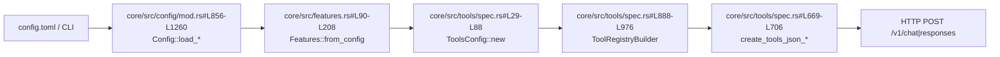
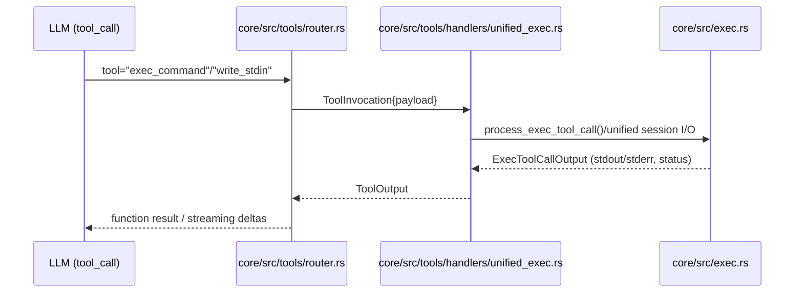
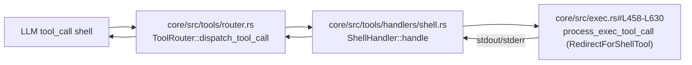
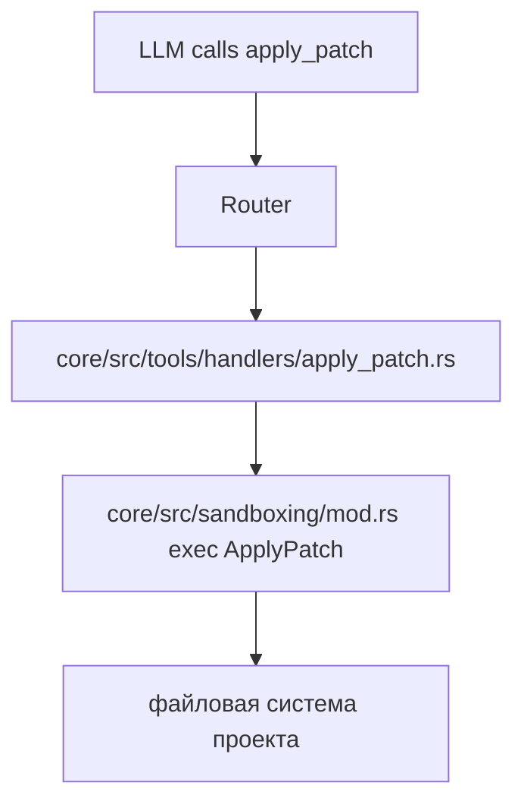

# TOOL_USE_README.md — каталог LLM-инструментов Codex

## 1. Как формируется список инструментов

1. Пользовательские настройки (`config.toml`, CLI `--enable/--disable`) попадают в `Config::load_from_base_config_with_overrides` (`core/src/config/mod.rs:856-1260`).  
2. Там же вычисляются включённые фичи (`core/src/features.rs:90-208`).  
3. `ToolsConfig::new` (`core/src/tools/spec.rs:29-88`) читает фичи, семейство модели и решает, какие группы инструментов доступны.  
4. `ToolRegistryBuilder` (`core/src/tools/registry.rs`) на основе `ToolsConfig` вызывает `builder.push_spec(...)` для каждого ToolSpec.  
5. `create_tools_json_for_responses_api`/`create_tools_json_for_chat_completions_api` (`core/src/tools/spec.rs:669-706`) сериализуют набор в JSON, который Codex отправляет любому совместимому LLM (OpenAI, vLLM, Ollama с прокси и т.д.).

## 2. Полный перечень инструментов

| Имя в API | Тип | Основной файл | Как включается | Назначение |
|-----------|-----|---------------|----------------|------------|
| `exec_command` | function | `core/src/tools/spec.rs:136-187` | Всегда, но использует unified-exec рантайм (`core/src/tools/handlers/unified_exec.rs`) | Запускает команду в PTY, возвращая вывод и `session_id`. |
| `write_stdin` | function | `core/src/tools/spec.rs:189-233` | Авто при включённом unified exec | Посылает байты в stdin существующего `exec_command` сеанса. |
| `shell` | function | `core/src/tools/spec.rs:234-279` | Включается для семейства, где нужен «старый» shell-обёртчик (`ToolsConfig.shell_type`) | Выполняет команду как один-shot без PTY, с поддержкой эскалации. |
| `local_shell` | специальный `ToolSpec::LocalShell {}` | `core/src/tools/spec.rs:888-895` + `core/src/tools/router.rs:101-133` | Всегда добавляется для Responses API | Позволяет OpenAI Responses запускать shell через нативный `local_shell` тип (превращается в `ResponseItem::LocalShellCall`). |
| `apply_patch` (freeform) | freeform | `core/src/tools/handlers/apply_patch.rs:165-212` | `Feature::ApplyPatchFreeform` или семейство, требующее JSON/Freeform | Пишет diff в формате `git apply`. |
| `apply_patch` (json) | function | `core/src/tools/handlers/apply_patch.rs:178-228` | По требованию семейства (например, планировщики) | Структурированный diff. |
| `update_plan` | function | `core/src/tools/handlers/plan.rs:20-78` | Всегда | Обновляет план пользователя: после успешного вызова Codex посылает `EventMsg::PlanUpdate`, который TUI/CLI отображают как чек-лист. |
| `grep_files` | function | `core/src/tools/spec.rs:367-415` | Включается, если семейство объявляет `experimental_supported_tools` с `grep_files`. |
| `read_file` | function | `core/src/tools/spec.rs:417-515` | Аналогично | Читает файл порциями. |
| `list_dir` | function | `core/src/tools/spec.rs:515-559` | Аналогично | Перечисляет содержимое директории. |
| `test_sync_tool` | function | `core/src/tools/spec.rs:305-365` + `handlers/test_sync.rs` | Только в отладочных профилях | Барьер для тестирования параллельных tool calls. |
| `view_image` | function | `core/src/tools/spec.rs:281-304` + `handlers/view_image.rs` | `Feature::ViewImageTool` (включён по умолчанию) | Прикрепляет локальное изображение к ответу. |
| `web_search` | специальный тип | `core/src/tools/spec.rs:965-976` | `Feature::WebSearchRequest` | Просит провайдера выполнить веб-поиск (поддерживается только там, где провайдер реализует тип `web_search`). |
| `list_mcp_resources` | function | `core/src/tools/spec.rs:560-591` + `handlers/mcp_resource.rs` | Всегда, если настроены MCP | Возвращает ресурсы MCP-серверов. |
| `list_mcp_resource_templates` | function | `core/src/tools/spec.rs:593-624` | То же | Возвращает шаблоны ресурсов MCP. |
| `read_mcp_resource` | function | `core/src/tools/spec.rs:626-659` | То же | Считывает конкретный ресурс MCP. |
| MCP tool proxy | function/freeform (динамически) | `core/src/tools/spec.rs:1008-1115` + `handlers/mcp.rs` | Автоматически для каждого зарегистрированного MCP сервера | Передаёт произвольные MCP-инструменты (интернет, IDE, базы данных). |

### 2.1 Планирование (`update_plan`)

- `update_plan` — обычный tool_call. Responses API не посылает отдельный SSE тип «plan delta»: всё держится на `tool_outputs`.  
- После успешного вызова Codex генерирует `EventMsg::PlanUpdate` (см. `exec/src/event_processor_with_human_output.rs:482-486`), а UI отображает чек-лист (`tui/src/chatwidget.rs:615-620`, `tui/src/history_cell.rs:1259-2234`).  
- Поэтому для внешнего API достаточно вернуть `tool_call` → дождаться `tool_outputs`. Никаких дополнительных эндпоинтов не требуется.

> **Важно:** даже если Codex объявляет инструмент, конечный LLM обязан поддерживать OpenAI-style tool calling. Ollama/vLLM умеют это только в режиме суммирования OpenAI API; чистые локальные провайдеры без such API проигнорируют инструменты.

## 3. Цепочки вызовов отдельных инструментов

### 3.1 `exec_command` / `write_stdin`

### 3.2 `shell` (не-PTY)

### 3.3 `apply_patch`

Если активирована freeform-версия, `ToolSpec::Freeform` заставляет модель генерировать патч в формате `*** Begin Patch`. JSON-вариант ожидает структурированные блоки.

### 3.4 MCP инструменты

Каждый MCP-инструмент сериализуется из конфигурации `mcp_server` (например, GitHub, Sentry, Playwright). Codex автоматически добавляет три «служебных» инструмента (`list_mcp_resources`, `list_mcp_resource_templates`, `read_mcp_resource`) плюс любые конкретные MCP tool definitions.

## 4. Особенности отдельных инструментов

### 4.1 `web_search`

- Добавляется только при `features.web_search_request = true` (см. `core/src/tools/spec.rs:965-976`).  
- Реализации OpenAI Responses действительно выполняют поиск, возвращая `ResponseItem::WebSearchCall` (`protocol/src/models.rs:112-145`).  
- Локальные провайдеры (Ollama, vLLM) чаще всего возвращают ошибку или игнорируют инструмент — у них нет встроенного веб-поиска.  
- При необходимости используйте MCP серверы с поиском вместо этой фичи.

### 4.2 `local_shell`

- Responses API умеет «родной» тип `local_shell`. Когда OpenAI/совместимый провайдер его создаёт, Codex преобразует `ResponseItem::LocalShellCall` в `ToolPayload::LocalShell` и вызывает тот же `ShellHandler` (`core/src/tools/router.rs:101-133`).  
- Используется при режиме `model_family.uses_local_shell_tool` (CLI/TUI), чтобы экономить токены: модель получает готовые кнопки «выполни shell».

### 4.3 MCP динамика

- MCP конфигурация описывается в `[mcp_servers]` (см. `docs/config.md`).  
- При старте `ToolRegistryBuilder` вызывает `mcp_tool_to_openai_tool` (`core/src/tools/spec.rs:1008-1115`), превращая каждую запись MCP в OpenAI-инструмент.  
- Любой вызов возвращает `ToolPayload::Mcp` и обрабатывается `handlers/mcp.rs`, который через `codex-mcp-client` вызывает внешний процесс.

### 4.4 Планировщик (`update_plan`)

- Даже если инструмент «ничего не делает», он критичен для UI: `handle_update_plan` (`core/src/tools/handlers/plan.rs:80-133`) посылает `EventMsg::PlanUpdate`, который TUI/Telegram отображают как чек-лист.

### 4.5 Осмотр файлов (`grep_files`/`read_file`/`list_dir`)

- Эти инструменты включаются только для тех семейств моделей, где `experimental_supported_tools` содержит соответствующие имена (см. `model_family.experimental_supported_tools`). Обычно это кодовые модели (gpt-4.1, gpt-5).  
- Локальные LLM (Ollama/vLLM) тоже получат описание инструментов, но должны сами уметь выдавать tool_calls.

## 5. Совместимость провайдеров

| Провайдер | Tool calling | Особенности |
|-----------|--------------|-------------|
| OpenAI Responses / Chat Completions | Полная поддержка (`function`, `web_search`, `local_shell`). | Рекомендуемый режим. |
| vLLM (OpenAI совместимый сервер) | Поддерживает `function`/`tool_calls`, но **не** реализует `type="web_search"` — инструмент будет проигнорирован. | Убедитесь, что `--enable-auto-tool-call` включён. |
| Ollama (`/v1/chat/completions`) | Требуется прокси, эмулирующий OpenAI API. Инструменты объявляются, но Ollama пока не генерирует `tool_calls`. | Используйте MCP вместо встроенных инструментов, либо ждите поддержки. |
| Прочие (Azure, Groq и т.п.) | Если совместимы с OpenAI Responses, всё работает. | Уточните у провайдера, реализован ли `web_search`/`local_shell`. |

## 6. Что помнить перед добавлением/использованием инструмента

1. **Конфигурация:** Проверьте, не отключает ли профиль нужную фичу (`core/src/config/profile.rs`).  
2. **Права:** `shell` и `exec_command` учитывают песочницу (`SandboxPolicy`). При попытке `with_escalated_permissions=true` Codex запросит подтверждение у пользователя.  
3. **UI:** Любой инструмент должен логировать события в `EventMsg`. Проверьте, что соответствующий handler отправляет `EventMsg::Tool...` (пример: `apply_patch` отправляет `PatchApplyBegin/End`).  
4. **Локальные LLM:** Если провайдер не умеет tool_calls, инструменты просто висят в payload и никогда не вызовутся. В таких случаях используйте MCP (ручные команды) или задайте `approval_policy` = `never` и выполняйте действия сами.  
5. **Документация:** При добавлении нового инструмента обновляйте `core/src/tools/spec.rs`, handler в `core/src/tools/handlers`, и README вроде этого.

Теперь у вас есть консистентная карта всех инструментов, которые Codex может предложить любому LLM, и понимание, как они проходят путь от конфигурации до HTTP-запроса и обратно.
